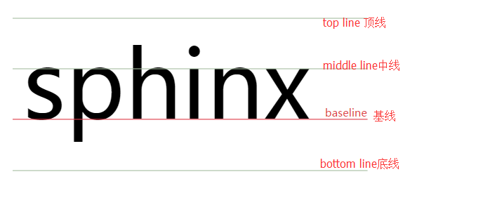

# vertical-align

[MDN vertical-align](https://developer.mozilla.org/zh-CN/docs/Web/CSS/vertical-align)
[vertical-align参考](https://www.cnblogs.com/starof/p/4512284.html?utm_source=tuicool&utm_medium=referral)

## 介绍

CSS 的属性 vertical-align 用来指定行内元素（inline）或表格单元格（table-cell）元素的垂直对齐方式。
vertical-align影响inline-level元素和table-cell元素垂直方向上的布局。根据MDN描述，vertical-align对::first-letter和::first-line同样适用。
适用于：
inline水平的元素

inline:,<span>,<strong>,<em>,未知元素
inline-block:<input>(IE8+),<button><IE8+>....
'table-cell'元素

table-cell:<td>
所以默认情况下，图片，按钮，文字和单元格都可以用vertical-align属性。

```css
baseline | sub | super | text-top | text-bottom | middle | top | bottom | <percentage> | <length>

/* Keyword values */
vertical-align: baseline;
vertical-align: sub;
vertical-align: super;
vertical-align: text-top;
vertical-align: text-bottom;
vertical-align: middle;
vertical-align: top;
vertical-align: bottom;

/* <length> values */
vertical-align: 10em;
vertical-align: 4px;

/* <percentage> values */
vertical-align: 20%;

/* Global values */
vertical-align: inherit;
vertical-align: initial;
vertical-align: unset;
```

## 行内元素的值

### 相对父元素的值

这些值使元素相对其父元素垂直对齐：

baseline
使元素的基线与父元素的基线对齐。HTML规范没有详细说明部分可替换元素的基线，如<textarea> ，这意味着这些元素使用此值的表现因浏览器而异。
sub
使元素的基线与父元素的下标基线对齐。
super
使元素的基线与父元素的上标基线对齐。
text-top
使元素的顶部与父元素的字体顶部对齐。
text-bottom
使元素的底部与父元素的字体底部对齐。
middle
使元素的中部与父元素的基线加上父元素x-height（译注：x高度）的一半对齐。
<length>
使元素的基线对齐到父元素的基线之上的给定长度。可以是负数。
<percentage>
使元素的基线对齐到父元素的基线之上的给定百分比，该百分比是line-height属性的百分比。可以是负数。

### 相对行的值
下列值使元素相对整行垂直对齐：

top
使元素及其后代元素的顶部与整行的顶部对齐。
bottom
使元素及其后代元素的底部与整行的底部对齐。
没有基线的元素，使用外边距的下边缘替代。

## 表格单元格的值
baseline (以及 sub, super, text-top, text-bottom, <length>, <percentage>)
使单元格的基线，与该行中所有以基线对齐的其它单元格的基线对齐。
top
使单元格内边距的上边缘与该行顶部对齐。
middle
使单元格内边距盒模型在该行内居中对齐。
bottom
使单元格内边距的下边缘与该行底部对齐。
可以是负数。

## baseline

1、字母‘x’与baseline

字母x的下边缘（线）就是基线。不是字母s之类下面有尾巴的字母

基线甚至衍生出了：

1. “alphabetic” baseline: “字母”基线 – 英文
2. “hanging” baseline: “悬挂”基线 – 印度文
3. “ideographic” baseline: “表意”基线 – 中文


2、baseline的确定规则

1、inline-table元素的baseline是它的table第一行的baseline。
2、父元素【line box】的baseline是最后一个inline box 的baseline。 
3、inline-block元素的baseline确定规则

规则1：inline-block元素，如果内部有line box，则inline-block元素的baseline就是最后一个作为内容存在的元素[inline box]的baseline，而这个元素的baseline的确定就要根据它自身来定了。
规则2：inline-block元素，如果其内部没有line box或它的overflow属性不是visible，那么baseline将是这个inline-block元素的底margin边界。